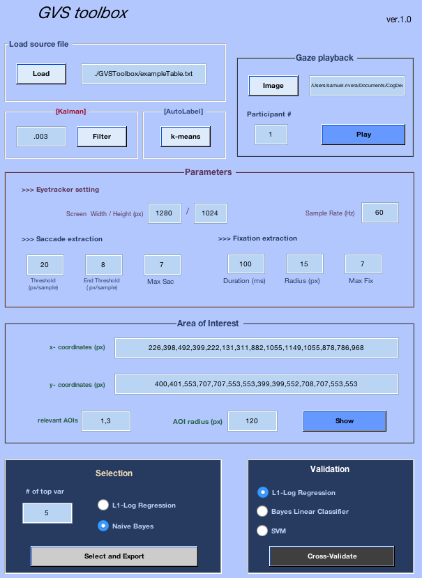
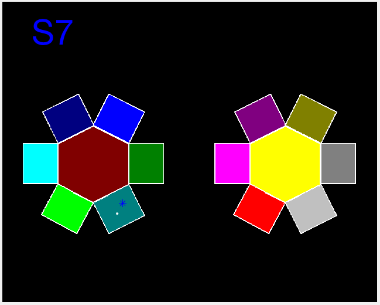
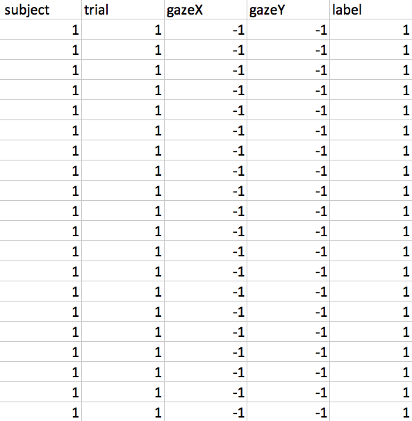

GVS Quick Start Guide
===

This MATLAB toolbox is meant to identify the relevant variables of the eye gaze. Copyright 2012, Samuel Rivera, Catherine Best, Hyungwook Yim, Aleix M. Martinez, Vladimir Sloutsky, and Dirk B. Walther at The Ohio State University.

This work was presented at CogSci 2012 in Japan. Please cite:

Rivera, S., Best, C., Yim, H., Martinez, A., Sloutsky, V., & Walther, D. (2012). Automatic selection of eye tracking variables in visual categorization for adults and infants. In N. Miyake, D. Peebles, & R. P. Cooper (Eds.), Proceedings of the 34th Annual Conference of the Cognitive Science Society (pp. 2240-2245).

---
## Installation

#### Non-coders    
    1. Click "download zip" at top of this GitHub page.
    2. Unzip downloaded file.
    3. Open MATLAB's path tool by clicking "Path tool" button or typing "pathtool" at command prompt.
    4. In the dialog that pops up, click "Add with subfolder..."
    5. Select the "GVSToolbox" directory, then click open.
    6. Click save.

#### Coders
    1. fork or clone
    2. In Matlab, navigate to "GVSToolbox" then run:

    >> addpath(genpath(pwd));

#### Installation Notes
* Libraries tested on linux and windows 64 bit.  libsvm (for SVM) may require additional steps to compile for your system.  Instructions inside (ExtraToolboxes). Optionally, just don't use SVM classifier.

* The toolbox uses several (included in "ExtraToolboxes" directory) software packages which implement L1 regularized optimization by [Mark Schmidt](http://www.di.ens.fr/~mschmidt/Software/L1General.html),
 support vector machine by [LibSVM](https://www.csie.ntu.edu.tw/~cjlin/libsvm/), and kalman filtering by [Kevin Murphy](http://www.cs.ubc.ca/~murphyk/Software/Kalman/kalman.html).

---
## Testing
    >> exampleEasy

## Graphical User Interface (GUI)
    >> simpleGUI

#### Visualization
Load source file and select image file then click play to visualize gaze over display. Visualization looks like this, but video:

## Data Format
* Data source file in following tab delimited format.
* Gaze coordinates assumed scaled in [0,1].

---
## Documentation

* Interactive HTML documentation (thanks to [m2html](http://www.artefact.tk/software/matlab/m2html/) package) in 'doc/GVSHome.html', or see the [online version](sriveravi.github.io/GVSToolbox).

* Supplement.pdf for detailed explanation of machine learning methods and parameter choices.

##  Examples

#### Source
See exampleTable.txt for an example data source file.  

#### General functionality
    >> exampleEasy

1. Load eye data, visualize, and extract variables
2. Identify relevant variables (and read them out)
3. Validate the variables

#### Graphical interface
    >> simpleGUI

#### Sample output:

    Top Naive Bayes selected variables:
    Var 1 is feat 1 of AOIFixDensity
    Var 2 is feat 2 of AOIFixDensity
    Var 3 is feat 3 of AOIFixDensity
    Var 4 is feat 4 of AOIFixDensity
    Var 5 is feat 7 of AOIFixDensity
    Exported to file variablesTable.txt
